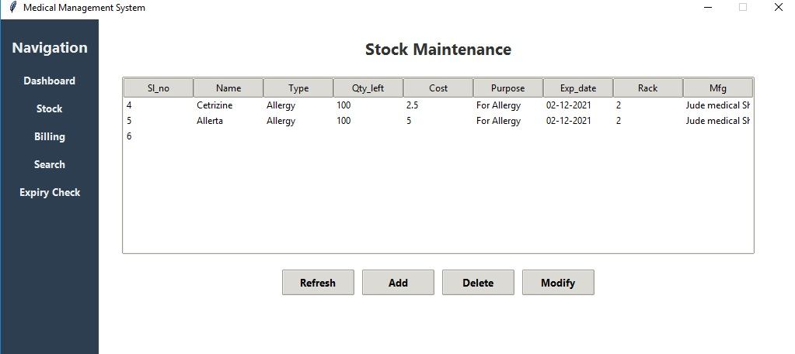
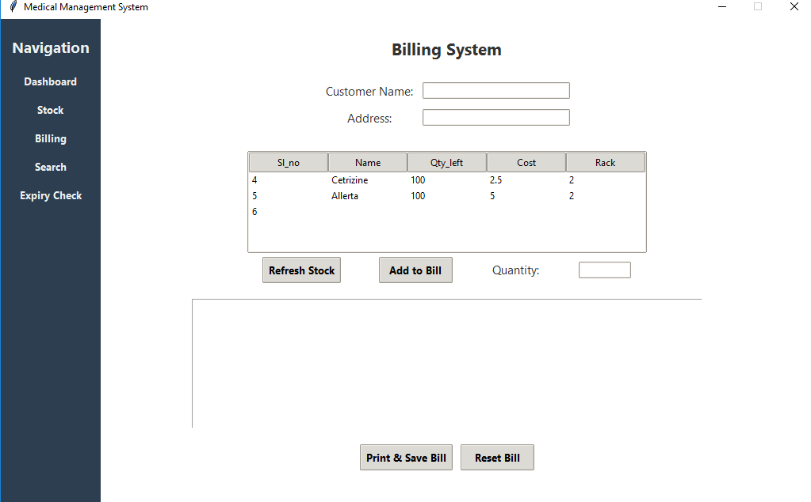

# Medical Management System

A modern, Tkinter-based desktop application for managing a medical store’s inventory, billing, and basic customer interactions. This application features a login system (for admin and customer roles), a sleek sidebar navigation, and separate pages for Dashboard, Stock Maintenance, Billing, Searching Medicines, and Expiry Checks.



> *Screenshot: The “Stock Maintenance” page from the Medical Management System.*



> *Screenshot: The “Billing” page from the Medical Management System.*

## Table of Contents

1. [Overview](#overview)
2. [Features](#features)
3. [Installation & Requirements](#installation--requirements)


---

## Overview

This project demonstrates how to build a **full-featured GUI** application in **Python** using:

- **Tkinter** for the user interface
- **SQLite** for local database management

It provides a user-friendly interface with a **navigation panel** and a **modern design theme**, enabling medical store administrators or employees to:

- Maintain stock of medicines
- Manage billing
- Track expiry dates
- Search for medicines by symptom/purpose
- Create or modify product entries in the database

---

## Features

1. **Login System**  
   - Supports admin and customer logins  
   - Admin has access to stock management, billing, and more  
   - Customer has limited access (e.g., searching medicines, checking expiry)

2. **Dashboard & Navigation**  
   - Modern sidebar for easy navigation  
   - Central content area for each page

3. **Stock Maintenance**  
   - View, add, modify, and delete medicines  
   - Displays all relevant fields (Name, Type, Quantity, Cost, Purpose, etc.)

4. **Billing**  
   - Generate bills with dynamic item addition  
   - Save and print bill details  
   - Update stock quantities automatically

5. **Search & Expiry Check**  
   - Search medicines by symptom/purpose  
   - Quickly check or list upcoming expiry dates

---

## Installation & Requirements

1. **Python 3.7+** (recommended 3.9+)
2. **Tkinter** (usually included with most Python installations)
3. **SQLite** (built into Python via the `sqlite3` library)
4. **Clone or download** this repository

**Recommended Steps**:
```bash
# 1. Clone the repository
git clone https://github.com/NileshChavan-academicprojects/Medical_Management_System

# 2. Navigate to the project directory
cd MedicalManagementSystem

# 3. (Optional) Create and activate a virtual environment
python -m venv venv
source venv/bin/activate  # or venv\Scripts\activate on Windows

# 5. Run the application
python main.py
